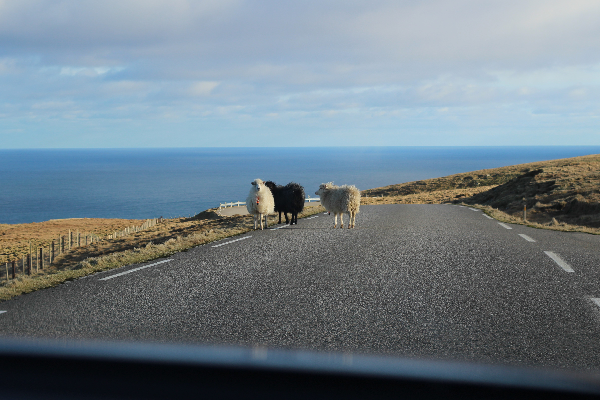

---
# Feel free to add content and custom Front Matter to this file.
# To modify the layout, see https://jekyllrb.com/docs/themes/#overriding-theme-defaults

layout: home
---


# Første dag i Vágur!
{{ date }}
 

 
Da har vi ankommet Færøyene, og mer spesifikt har vi kommet til den lille byen Vágur på Suðuroy. Det er en øy med rundt fire-fem tusen innbyggere, og Vágur har rundt 1400 av disse. For å komme hit fløy vi først til Tórshavn fra Oslo, og så var det en fergetur på omlag to timer før vi kom fram til Suðuroy. Vel framme møtte vi vår kontakt i kommunen, som kunne vise oss huset vi skal bo i de neste seks ukene.

### Vágur:

 

## Her skal vi jobbe og bo!

Dette er det søte lille huset hvor vi skal bo! Det er kommunen som er så gavmild og låner det til oss.

 

Og her er kontoret hvor vi skal jobbe (et såkalt "Co-working space"). Der er det fire plasser i åpent landskap, to kontorer, toalett og et kjøkken. Alt man trenger!

 

## En liten tur i lunsjen

Etter at vi var kommet på plass med hjem og kontor bestemte vi oss for å ta oss en liten runde i nabolaget. Selv om byen er et koselig og pent sted, så er nok hovedattraksjonen i bygda den vakre naturen som omslutter den!

<!--  -->

 

## Ferdig på jobb!

Da tok vi oss like gjerne en kjøretur rundt mye av det sørlige Suðuroy! 
Dette er det vi så.

<!--  -->

<!--  -->

